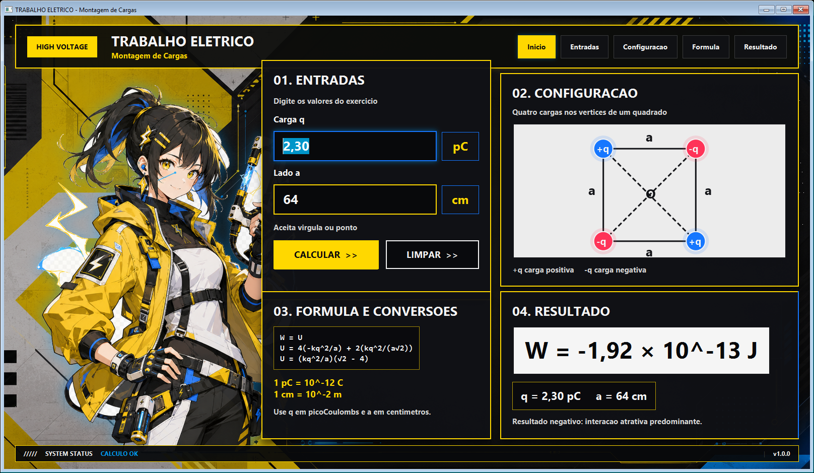
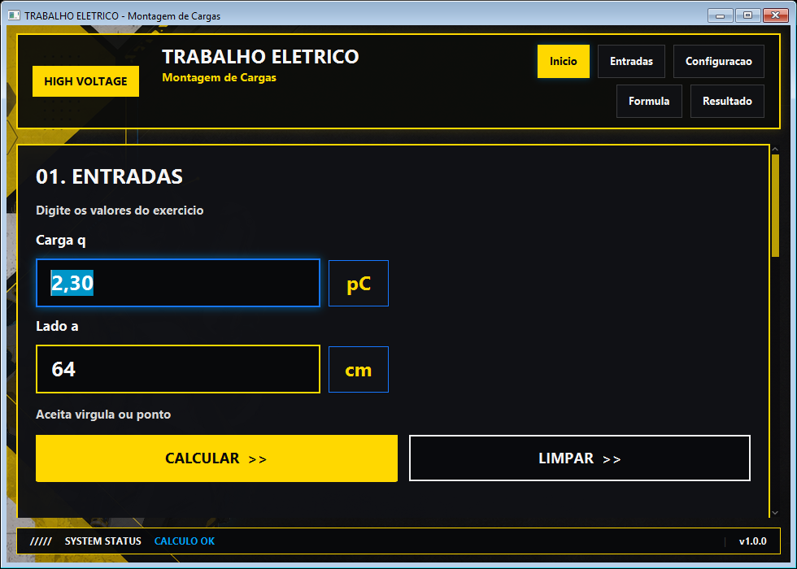

# TRABALHO ELETRICO - Montagem de Cargas

Aplicacao desktop em **Java 21 + JavaFX** para calcular o trabalho necessario para montar quatro cargas eletricas nos vertices de um quadrado.

A interface atual segue um estilo **cyberpunk/anime amarelo e preto**, com fundo tecnico, personagem animada, paineis com bordas neon, faíscas eletricas e resultado em notacao cientifica.



Versao responsiva em janela menor:



## Objetivo

O usuario informa:

- carga `q` em picoCoulombs (`pC`);
- lado do quadrado `a` em centimetros (`cm`).

O app calcula:

```text
W = U
U = 4(-kq^2/a) + 2(kq^2/(a√2))
U = (kq^2/a)(√2 - 4)
```

Constante e conversoes:

```text
k = 8,99 x 10^9 N.m^2/C^2
1 pC = 10^-12 C
1 cm = 10^-2 m
```

Exemplo:

```text
q = 2,30 pC
a = 64 cm
W = -1,92 x 10^-13 J
```

## Recursos da interface

- fundo `background.png` em tela cheia;
- personagem `hero_character.png` com transparencia real;
- faíscas eletricas animadas;
- painel de entradas com validacao amigavel;
- desenho JavaFX do quadrado com `Circle`, `Line` e `Text`;
- painel de formulas e conversoes;
- painel de resultado com interpretacao fisica;
- botoes com hover e animacao;
- entrada dos paineis com fade/slide;
- layout responsivo: em telas largas usa cards em duas colunas; em telas menores empilha os paineis em uma coluna com scroll.

## Estrutura

```text
src/
|-- Main.java
|-- app/
|   |-- MainView.java
|   |-- BackgroundLayer.java
|   |-- HeroCharacterPane.java
|   |-- ElectricSparksPane.java
|   |-- MotionEffects.java
|   |-- layout/
|   |   |-- HeaderBar.java
|   |   `-- FooterStatusBar.java
|   `-- panels/
|       |-- InputPanel.java
|       |-- ChargeSquarePane.java
|       |-- FormulaPanel.java
|       `-- ResultPanel.java
|-- model/
|   `-- PhysicsCalculator.java
|-- util/
|   `-- NumberUtils.java
`-- resources/
    |-- style.css
    `-- assets/
        |-- background.png
        |-- hero_character.png
        |-- header_bar.png
        `-- raw/

tools/
`-- remove_fake_background.py
```

## Como executar

No Windows PowerShell:

```powershell
.\run.ps1
```

Ou compile manualmente:

```powershell
.\build.ps1
```

## Como gerar executavel Windows

```powershell
.\package.ps1
```

Saida:

```text
dist/CalculadoraCargas/CalculadoraCargas.exe
dist/CalculadoraCargas-windows.zip
```

## Como gerar app Linux

Em Linux com JDK 21:

```bash
bash package-linux.sh
```

## Remover checkerboard falso dos assets

O projeto inclui:

```text
tools/remove_fake_background.py
```

Uso:

```powershell
python tools\remove_fake_background.py
```

O script le imagens em `src/resources/assets/raw/`, remove fundo falso conectado às bordas e salva PNGs finais em `src/resources/assets/`.

## Observacao de build

Neste ambiente Windows, o `javac` gera `out/classes` corretamente, mas imprime um aviso `AccessDeniedException` ao fechar `javafx.controls.jar`. O script termina com codigo `0` e o app abre normalmente.
