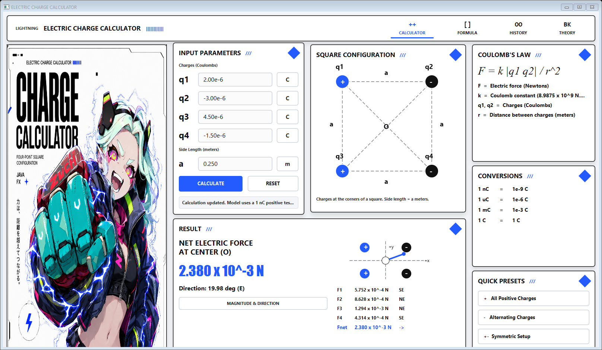

# ELECTRIC CHARGE CALCULATOR

Aplicacao desktop em **Java 21 + JavaFX** com foco em UI/UX premium para estudar cargas eletricas nos vertices de um quadrado.

A versao atual foi redesenhada como um dashboard sci-fi/anime: painel branco futurista, linhas tecnicas pretas, acentos em azul eletrico, personagem cyberpunk no hero e paineis separados para entrada, configuracao, formula, conversoes, resultado e presets.



## Funcionalidades

- entrada para `q1`, `q2`, `q3`, `q4` em Coulombs;
- entrada para o lado `a` em metros;
- calculo da forca eletrica resultante no centro `O`;
- resultado em notacao cientifica;
- direcao em graus e direcao cardinal aproximada;
- diagrama do quadrado com cargas positivas em azul e negativas em preto;
- mini diagrama vetorial;
- presets rapidos para diferentes configuracoes;
- validacao de entrada com mensagem amigavel;
- tema JavaFX completo em CSS.

## Modelo fisico usado na UI nova

A tela premium calcula a forca resultante no centro do quadrado considerando uma carga teste positiva de `1 nC` em `O`.

Para cada carga nos vertices:

```text
F = k |q_i q_teste| / r^2
```

Onde:

```text
k = 8.9875 x 10^9 N.m^2/C^2
q_teste = 1 x 10^-9 C
r = distancia do vertice ao centro
```

As componentes `Fx` e `Fy` de cada carga sao somadas para obter:

```text
Fnet = sqrt(Fx^2 + Fy^2)
angulo = atan2(Fy, Fx)
```

## Estrutura principal

```text
src/
|-- Main.java
|-- app/
|   |-- MainView.java
|   |-- components/
|   |   |-- TechButton.java
|   |   |-- TechCard.java
|   |   |-- TechTextField.java
|   |   `-- UnitField.java
|   |-- layout/
|   |   |-- HeaderBar.java
|   |   |-- HeroPanel.java
|   |   `-- FooterStatusBar.java
|   |-- model/
|   |   `-- ChargeCalculatorModel.java
|   `-- panels/
|       |-- InputParametersPanel.java
|       |-- SquareConfigurationPanel.java
|       |-- CoulombLawPanel.java
|       |-- ConversionsPanel.java
|       |-- ResultPanel.java
|       `-- QuickPresetsPanel.java
|-- model/
|   `-- PhysicsCalculator.java
|-- view/
|   `-- componentes da versao anterior
`-- resources/
    |-- style.css
    `-- assets/
        `-- hero_character.png
```

## Como executar no Windows

```powershell
.\run.ps1
```

O script compila o projeto e abre a aplicacao. Se o JavaFX SDK 21.0.4 nao existir em `lib/`, o build tenta baixa-lo automaticamente.

## Como gerar executavel Windows

```powershell
.\package.ps1
```

Saida esperada:

```text
dist/CalculadoraCargas/CalculadoraCargas.exe
dist/CalculadoraCargas/Abrir CalculadoraCargas.cmd
dist/CalculadoraCargas-windows.zip
```

## Como gerar app Linux

Em Linux com JDK 21:

```bash
bash package-linux.sh
```

Saida esperada:

```text
dist-linux/CalculadoraCargas/Abrir CalculadoraCargas.sh
dist-linux/CalculadoraCargas-linux.tar.gz
```

## Execucao pelo IntelliJ IDEA

1. Abra esta pasta como projeto.
2. Configure o SDK como Java 21.
3. Execute a classe `Main`.

Se o IntelliJ pedir parametros de VM:

```text
--module-path lib/javafx-sdk-21.0.4/lib --add-modules javafx.controls
```

## Observacao de build

Em alguns ambientes Windows, o `javac` termina com codigo `0`, gera as classes corretamente, mas mostra um aviso `AccessDeniedException` ao fechar `javafx.controls.jar`. Neste projeto isso apareceu apos a compilacao, com `out/classes` gerado corretamente.

## Documentacao

- [Arquitetura](docs/ARQUITETURA.md)
- [Explicacao do calculo original de trabalho](docs/CALCULO_EXPLICADO.md)
- [PDF explicativo](docs/calculo-cargas-eletricas.pdf)
